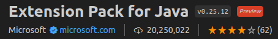
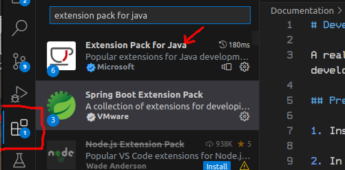
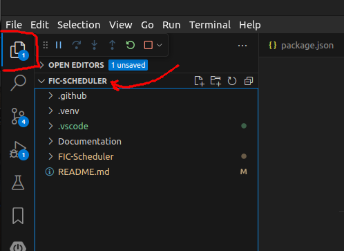
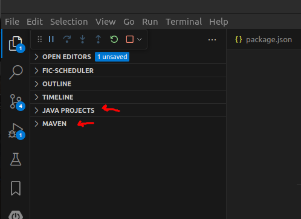
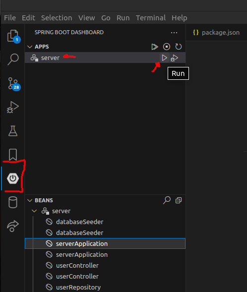

# Developer Setup Overview

A really short step-by-step to get your dev machine set up for development.

## Pre-Setup

1. **Install VS Code**

2. In VS Code, **make sure you have the Java tools installed** -- that's the **"Extension Pack for Java"**

    

    (Open the Extensions Manager sidebar in VS Code, Ctrl+Shift+X if you don't see it)

    

    Other extensions that will make your life *much* better working with this project/on this team:
    - **Spring Boot Dashboard** (Microsoft) - Important! To launch the server in the debugger easily
    - **EditorConfig for VS Code** (EditorConfig) - Important! So formatting respects .editorconfig settings
    - **Markdown Perview Mermaid Support** (Mark Bierner) - To preview this documentation better
    - **Live Share** (Microsoft)

    You might also have use for these:
    - **GitHub Pull Requests and Issues** (github.com)
    - **Jupyter** (Microsoft)
    - **Docker** (Microsoft)

3. **Install npm** (this works different on different platforms so you're on your own with the documentation here -- I'm using npm 9.5.1 and Node 18.16.1 on Ubuntu 22.04; I installed nvm from the repository and used "nvm install --lts" to get the latest LTS version of npm/node installed to my user account, instead of trying to install for the whole system.

    node/npm do have native installers for Windows and Mac AFAIK, and maybe that's the easiest choice for you, but **I would be inclined to use some kind of unixy package management system**: on Windows, **Ubuntu via WSL2**, or on Mac, **homebrew** (my first choice) or MacPorts or possibly nix -- and you probably also want to install git and openssh in the same environment if you're doing that.

4. Clone the project (or pull if you already had it)

## Backend Setup

If you're just doing frontend work maybe just the frontend is enough for you to test, but once auth is working properly you'll probably need the backend as well.

1. **Open the project root in VS Code** -- you should see something like this in your file browser:

    

    If the Java support is working correctly, it should have Java Project and Maven tabs:

    

2. **Go to the hexagonal "Spring Boot Dashboard" sidebar tab further down.** It takes a little while for the Java tools to figure out your project if you're loading them for the first time, but eventually you should see the "server" under APPS at the top:

    

3. **Press the Run (or Debug I guess if you want to debug) button right there** -- that's the one next to the Run tooltip in the screenshot

That will start the backend server at <http://localhost:8080/>. Now you need to start the frontend!

## Frontend Setup

1. **Go to the client folder in your local checkout** (in your favourite shell where you can run dev tools like npm which you just installed)

    This will be something like `$(project_root)/FIC-Scheduler/client`. If you run the `npm i` from the wrong place it will dump a bunch of junk there, like a `node_modules` folder and whatnot.

2. **Run `npm install`** to install all the depencies (also do this if you already had the project, a bunch of dependencies just got added as of this morning)

3. **Run `npm run start`** to start the frontend web server

The frontend should now be running at <http://localhost:3000/>, but it will probably open a browser pointed there automatically so you might not even need to type that in.

## N.B

**Both the frontend and backend are pretty good about hot-reloading, but there will be times when you need to restart their servers!**
