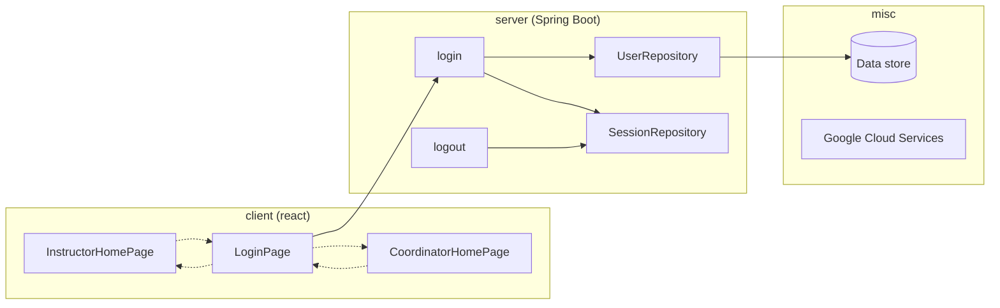

# Software Architecture

From a logical perspective, the software is structured as a stack. We show pages, endpoints, and some MVC objects as submodules within the projects to capture a little of their important interactions:

