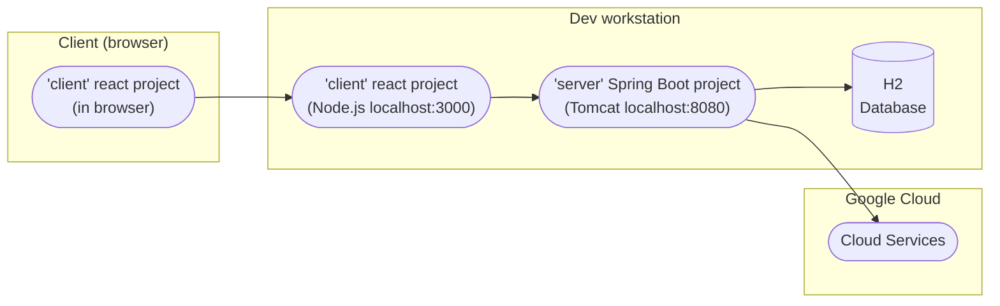
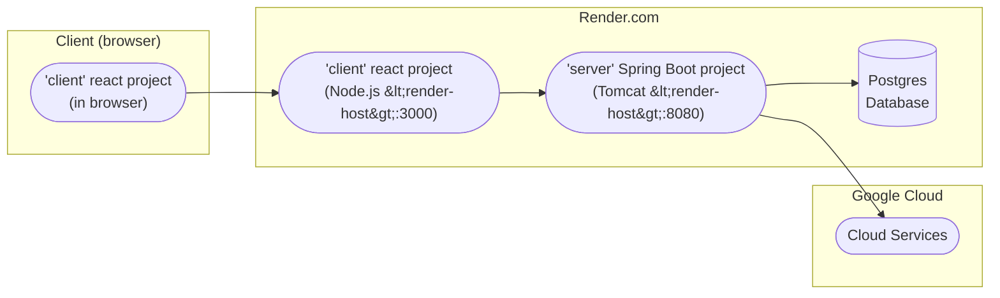
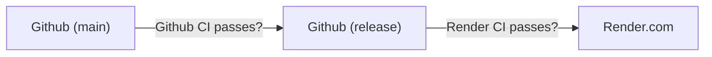

# Static Deployment

These diagrams show where the various components of the software are deployed in development and production, and their lines of communication.

## Development/Testing

## Production

## Overview

The application is physically spread across multiple projects and execution environments. The "client" project is built using react and is served by Node.js from Render; some portions are transpiled and delivered as javascript to be executed locally on the browser client, but others execute on the Node.js server. The "server" project runs exclusively on the Render servers and interfaces directly with the data store, which is a Postgres database in production, and H2 during development.

## Security

As a general model the "client" project is untrusted and not responsible for actual security even where it runs on the server. It does not have credentials to access the data store directly. The "server" project is trusted and handles all authentication and real session management, and does have direct (privileged) access to the data store.

# CI/CD Flow

For more context and information about the Git workflow and process of preparing a release, see the `branch-workflow` policy document. This diagram only shows the *path* the software takes from development to deployment.

Merging from `main` -> `release` is a manual process. Deployment from `release` to Render.com is automated.

Github CI is configured via YAML files. Render CI automatically deduces the right Maven targets to call based on Spring Boot conventions.

