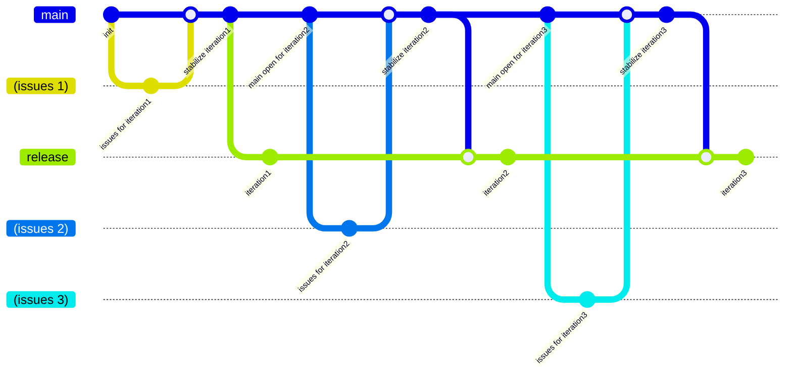
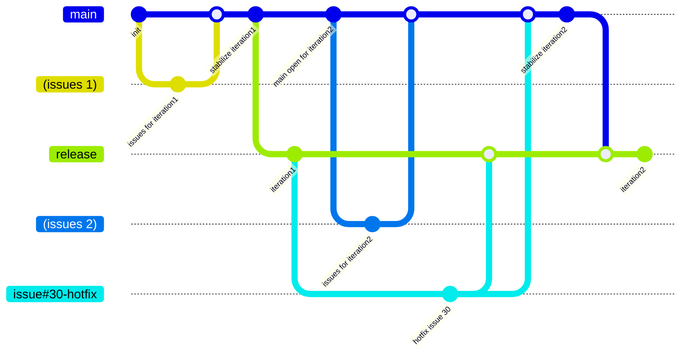
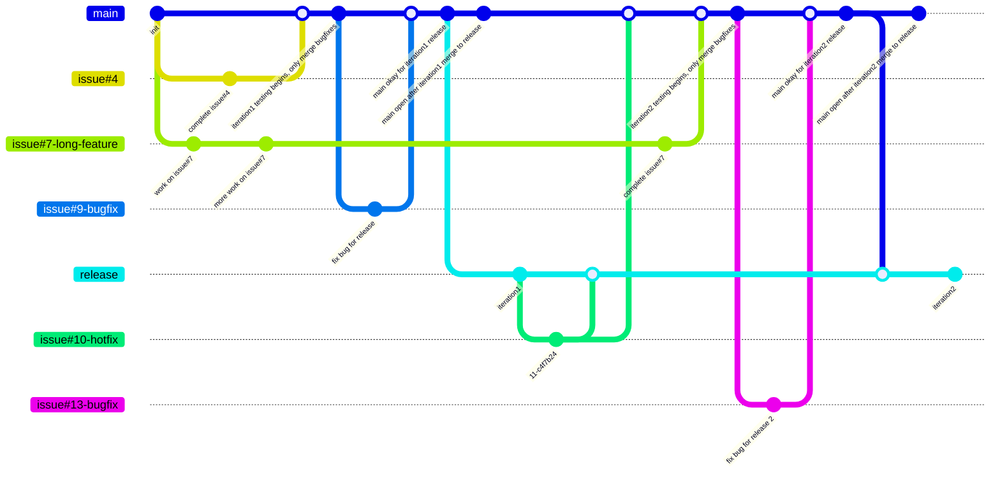
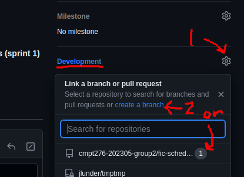
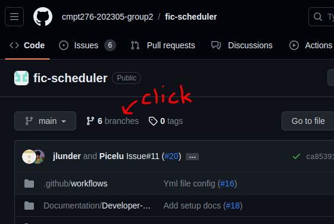
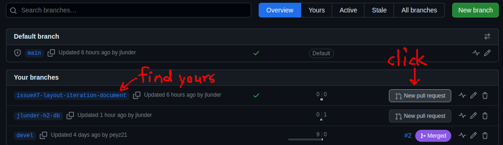
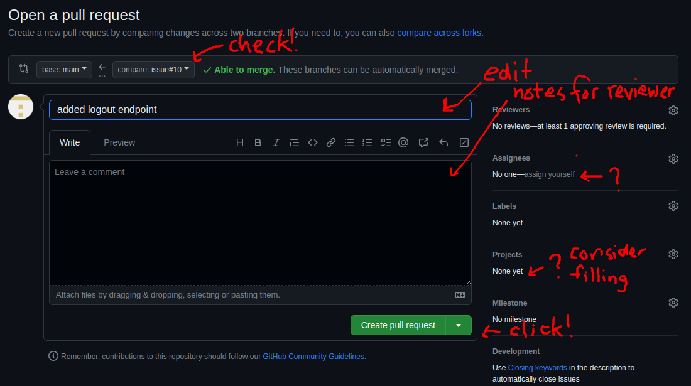
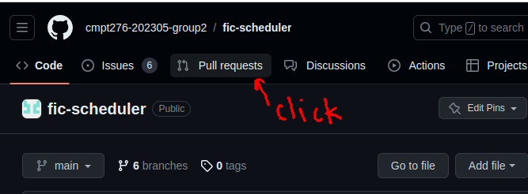
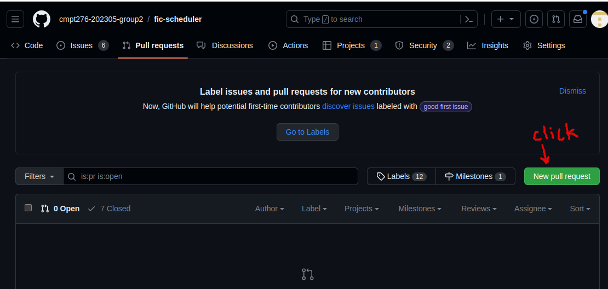
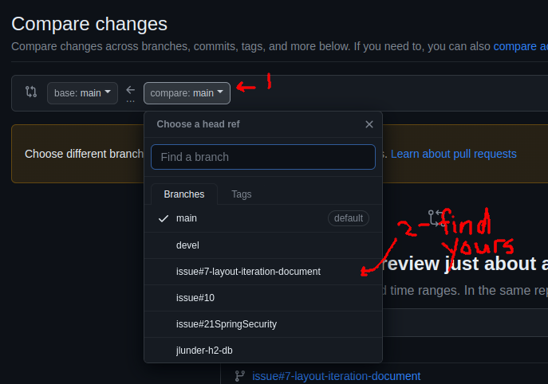

# Branch Workflow

This is a reasonably long document and you don't need to read it all at once, but you will probably eventually need to understand most of it.

Here are the most important parts which you should find and read now:

- Skim the "Ideal World Development And Release Flow" diagram and if it doesn't make sense, dig into the following sections and/or ask questions. You don't need to fully understand hotfixes but you should sort of get the release process.
- Skim the "Feature Development" section
- **Read the "Code Review Principles" section!**

The later bits about "Stabilization And Deployment" are parts not everyone needs to understand. The people managing deployment will be responsible for gathering everyone together and clearly saying when you can/can't merge PRs.

## Branches

### Ideal World Development And Release Flow

This diagram lumps all the feature branches for a particular iteration into one "(issues X)" branch, and ignores the possibility of hotfixes, but it represents a sort of simplified ideal world scenario:

There are 2 persistent branches, plus feature branches for development, bugfixes, and hotfixes. The persistent branches are:

1. main - the unstable branch where development is coordinated
2. release - the (relatively) stable branch monitored by CI

For every issue, developers should create a new branch with a name like `issue#X...` where X is the related Github issue number, and ... is an optional suffix which the developer can use to better identify the branch to themselves. **For example:**

- `issue#35` and `issue#35-sched-gen-perf` are both acceptable names for a branch where work is being done on (made up) Github Issue 35, "Performance of schedule generation poor in some situations".

Generally if something is worth working on it's worth making an issue for, but if for whatever reason there is not an issue associated with a branch - maybe it's speculative work, for example - branches should be named after the creator's github username, plus a descriptive suffix. **For example:**

- `jlunder-policy-doc-branching` is an acceptable name for the branch which introduces this policy documentation.

### Hotfixes

If development has already restarted on `main`, and a critical problem is discovered with the released software, an awkward situation arises where a fix is needed more urgently than a full release cycle where `main` is stabilized. Moreover, adding new features together with a fix is risky even in the best circumstances.

In this situation it's better to craft a targeted hotfix by branching from the `release` branch, test the hotfix separately, and merge it directly back into `release`. If it's possible to merge the fix into `main`, this should also be done so that it doesn't get lost in future releases (but in some cases the fix will be a hack and should explicitly *not* be merged back).

### More Complete Example Git Graph

## Feature Workflow Step By Step

### Feature Development

1. Create a branch for the feature named `issue#<ISSUE>[...]` where \<ISSUE\> is the actual issue number, and [...] is an optional descriptive suffix.

    **Note:** You can link a feature branch to an actual issue via the "Developer" pane in the bottom-right of the Github issue page:

    

    You can either create the branch here and then pull it into your local repository and check it out, or you can create it in your local repository, push it to Github, and then link it (basically the exact reverse). Either way works!

2. Think through your code and do a little design and if possible, start some documentation.

3. If you're doing test-first development, write a few tests and add some skeleton code that fails the tests.

4. Develop your feature locally on your feature branch. **Push feature changes regularly to Github.** If you need help, others will be able to pull your branch and check it out to work on it as well.

    It's good practice to leave the code in a working state even in your own intermediate commits, but it's not essential. Do whatever is fastest.

5. When the code seems ready, do some manual testing to make sure, including testing other parts of the code which have some connection to your code. **Rerun existing automated tests.**

    Now is a good time to add some automated tests if you didn't write tests first.

6. **Merge latest `main` into your development branch and *redo your testing* in at least a cursory way.** Forgetting this step is a great way to break the build.

7. Open a PR for your change in Github. There are 2 main ways, either via the branches tab:

    1. Go to the Branches page by clicking on the "... branches" link, next to the branch selection, near the top of the page

        

    2. Find your branch in the list, and click "New pull request" on that row, on the right side

        

    3. Fill out the pull request form (the only critical part is to make sure the title is good enough), and click "Create pull request"

        

    Or via the Pull Requests tab:

    1. Click "Pull requests", at the top of the page

        

    2. Click "New pull request", at the top-right of the page

        

    3. Choose the branch you want to merge FROM in the "compare:" dropdown ("base:" is the branch you want to merge TO and it should generally be `main` unless you're doing something special and really know what you're doing, e.g. merging `main` into the `release` branch for deployment)

        

    4. Fill out the pull request form (the only critical part is to make sure the title is good enough), and click "Create pull request"

        

    You'll end up at the same place either way!

8. Now that you have a new pull request, copy the URL from Github and paste the link into `#⁠pr-review-fic` on the Discord server. Next, someone else has to review your work.

### Code Review Principles

Code Reviews are important but also a little sticky. They're important:

- They spread knowledge around the team implicitly
- They catch silly mistakes before they block the whole team
- They keep us honest with respect to policy

But they can also be a drag on development:

- The longer code goes without being merged into main, the more the surrounding code changes and the harder it is to merge: review delay creates extra work
- It's easy to promise to review something and forget about it
- Sometimes it isn't practical to move on to the next task while you're waiting for a review
- Rubber-stamp reviews are a waste of everyone's time
- Overly nitpicky reviews or reviews where fundamental design decisions can be even worse than a rubber stamp: if you're asking someone to go back to the drawing board there had better be a very good reason

**With that in mind, here are Joe's code review principles:**

- **Don't claim a review if you can't get started in the next 15 minutes. If something comes up and you have to abort the review, say so in Discord!**
- **Look for basic problems, like coding guideline violations and obvious bugs, but only bring up design issues if the design can't work or is a serious policy violation e.g. the design creates a bad security issue.**
- **Check for automated tests and ask about manual testing. We all need the reminder sometimes.**
- **Try to diversify whose code you are reviewing, and if you've been doing a lot of them, let someone else have a turn. Maximize the knowledge sharing through the whole team.**

### Code Review Process

1. If you see a review appear in `#⁠pr-review-fic` on the Discord server, and you have the time to read it and think about it, jump on the review. If you're looking, add 👀 react to the request to claim it. If someone else has eyes on it, you can skip to the next PR! Try not to double up.

2. When reviewing, don't be afraid to write questions or comments inline, you should have SOMETHING to say about most PRs unless they're absolutely trivial.

3. If the code is good enough (and it probably will usually be), approve the PR. add a ✅  react to the request so the requester knows it's okay to merge.

4. If you think it's important that the code get in right away, you may squash-merge and delete the branch, instead of waiting for the author to do it. Obviously don't squash-merge unless you're approving the changes as-is. If changes are requested let the original author have a chance to fix them.

5. Authors, don't forget to go back and look for comments **even if the PR is approved**.

    Reviewers, if a comment you make is particularly important, please say something about it in the reviews channel (maybe in a thread?) so that it for sure gets noticed.

## Stabilization And Deployment

### Stabilization Process

1. Announce to `#general` and `#pr-review-fic` that we're stabilizing and nobody may merge any PRs into `#main` until further notice, unless they're related to stabilization. If you're reviewing an unrelated PR and you see this notice, don't approve the PR! Wait.

2. Whoever is helping with stabilization tests (with the development server) the code that's on main. Bugs get issues as usual and fixes follow the normal PR process.

3. When things look okay to deploy, merge `main` into `release`. Check that the two branches are identical after merge.

4. Wait for CI/CD to deploy to the production server, then do a final testing pass on production.

### Automated Testing

Talk about testing gating PRs

### Deployment

Talk about development server (main) vs production server (release)

### Hotfixing Deployment

Talk about hotfix (feature) branches right off release, and back integrating release to main
